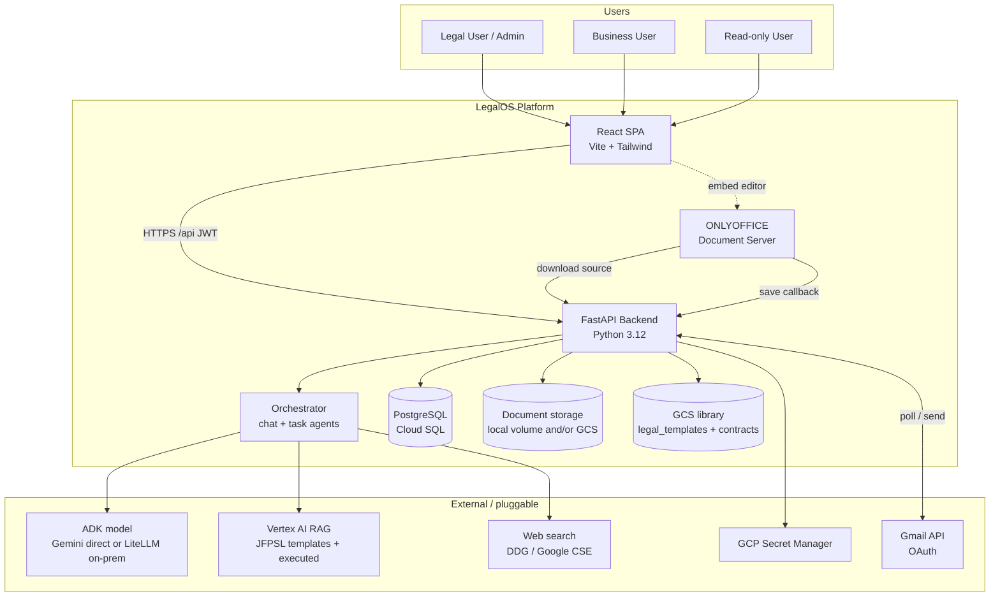
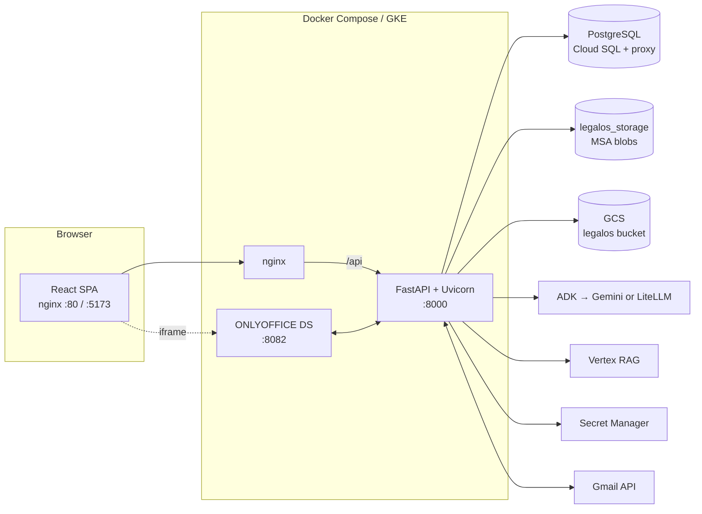
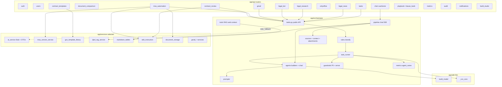
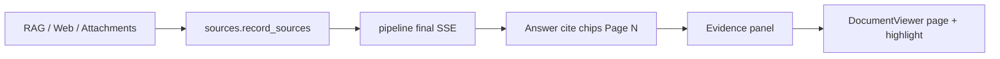
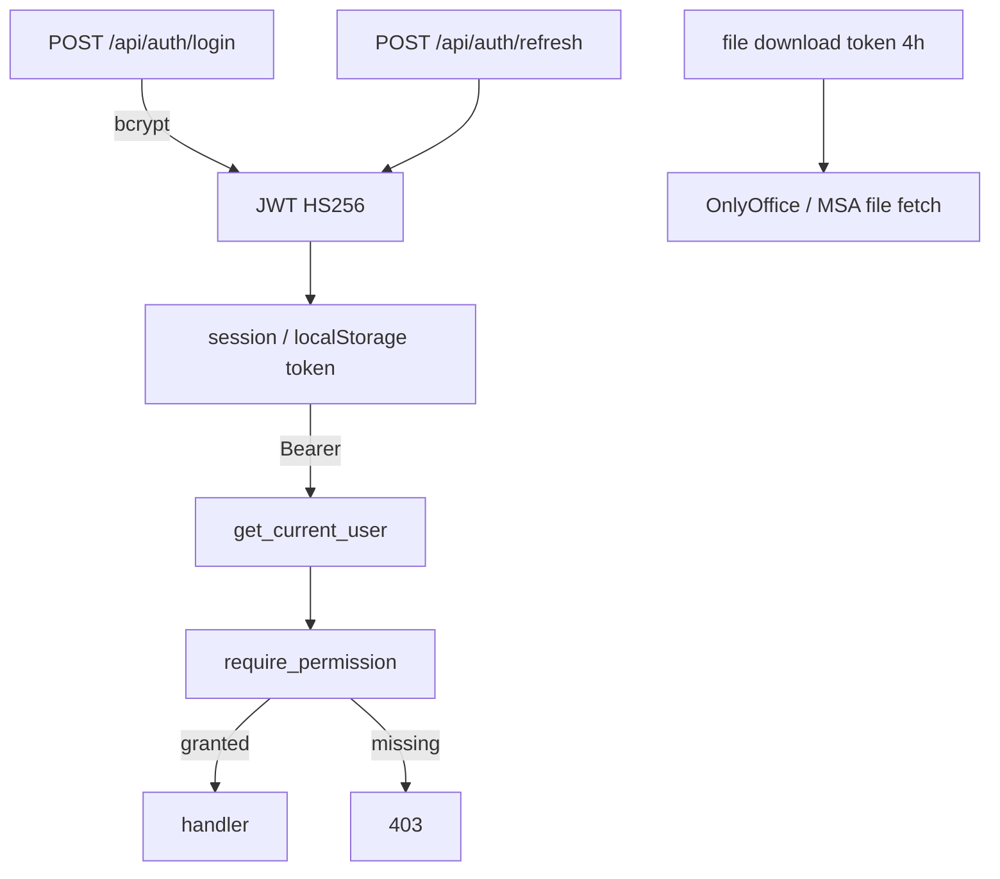

# LegalOS — Architecture Overview

> Internal Legal AI platform for JFPSL Corporate Legal. Replaces Legistify / Lucio / SpotDraft
> with an in-house, RBAC-governed, audit-first system.

This document describes **how the system works today**. For schemas, algorithms, API tables,
sequences, and implementation detail see [LOW_LEVEL_DESIGN.md](./LOW_LEVEL_DESIGN.md).

---

## 1. System context



**Key principles**

- **One orchestrator home for LegalAI** — all generation for product modules lives under
  `backend/app/orchestrator/`. Discrete jobs call `orchestrator.tasks` with a fixed
  `(module, operation)`; LawGenie chat uses the conversational SSE pipeline. There is **no**
  `LegalAIService` / `get_ai_service()` facade.
- **Rule-based dispatch for known jobs** — APIs already know the job (MSA review, Gmail reply,
  etc.). `rules.classify(module, operation)` maps to a fixed `AgentId`. No LLM router for those paths.
- **Chat keeps specialist transfer** — open-ended LawGenie Q&A uses ADK `transfer_to_agent`
  among contract / compliance / discovery specialists.
- **Grounded answers** — JFPSL Vertex RAG first, then web; attachments/MSA/Gmail context become
  chunk-level `Source`s with Evidence UI for hallucination checks.
- **Data residency** — production inference should go through on-prem LiteLLM (`ADK_MODEL` +
  `ADK_LITELLM_*`). Direct Gemini is for dev/pilot.
- **RBAC-first** — every endpoint is permission-gated; the UI mirrors the same matrix.
- **Audit + token governance** — AI calls and human decisions write `AuditLog`; LLM usage is
  recorded on `llm_usage_logs` / `llm_turn_metrics` with `module`, `operation`, and `agent_name`.

---

## 2. Repository layout

| Path | Role |
|------|------|
| `frontend/` | Vite + React + TypeScript SPA; nginx image for prod (same-origin `/api`) |
| `backend/` | FastAPI app (`app/`), Alembic migrations, `scripts/`, `tests/`, `adk_web/` |
| `backend/app/orchestrator/` | Chat pipeline, task agents, tools, prompts, sources, guardrails, SSE, memory |
| `backend/app/adk/` | Low-level ADK helpers only: `models.build_model()`, `runner._run_coro` |
| `backend/app/services/` | Business logic (MSA, Gmail, storage, GCS templates, DOCX, RAG, stubs, …) |
| `backend/adk_web/legalos_orchestrator/` | Dev-only `adk web` entry re-exporting the root agent |
| `config/` | Secret JSON templates: `legalos-secret.{dev,uat,prod}.json` |
| `docs/` | This architecture + LLD |
| `helm-chart/` | Kubernetes chart + per-env values |
| `docker-compose.yml` | Local: backend, frontend, OnlyOffice |
| `Templates/` | Local JFPSL DOCX corpus for Vertex RAG sync (often gitignored) |
| `contracts/` | Executed-contract corpus for RAG / library sync (often gitignored) |

---

## 3. Container / deployment view



| Service | Stack | Port | Purpose |
|---------|-------|------|---------|
| frontend | node build → nginx:alpine | 80 / 5173 | SPA + reverse proxy `/api` → backend, `/onlyoffice` → DS |
| backend | python:3.12-slim, FastAPI | 8000 | REST, orchestrator, migrations on boot |
| onlyoffice | onlyoffice/documentserver | 8082 | DOCX editing with native track changes |
| postgres | Cloud SQL / local | 5432 | System of record (Alembic) — **not** in compose |
| storage | docker volume `legalos_storage` | — | MSA/negotiation document blobs (local path) |
| GCS | `legalos` bucket | — | Template library + optional MSA docs |

Backend entrypoint: `alembic upgrade head` then `uvicorn`. Lifespan seeds reference data, warms the
orchestrator runner (when `ORCH_ENABLED`), and may start Gmail poll / notification / news scrape loops.

Secrets resolve from GCP Secret Manager (`legalos_dev` / `legalos_uat` / `legalos_prod` by
`LEGALOS_ENV`) or local `config/legalos-secret.*.json` / env. Service-account key file is used
off-GCP; Workload Identity / ADC on GKE.

---

## 4. Backend module map



Routers stay thin: auth, validation, orchestration. Heavy lifting lives in `services/` and
`orchestrator/`. **Build Studio** uses its own `agent_service.py` stub coding agent and is
**out of scope** for the LegalAI orchestrator.

All LegalAI prompts live under `orchestrator/prompts/` (there is no separate `app/prompts/`).

---

## 5. AI architecture (current)

### 5.1 Two paths

| Path | Entry | Routing | Use |
|------|-------|---------|-----|
| **Task / structured** | `orchestrator.tasks.*` | `rules.classify(module, operation)` → fixed agent | MSA review/edit, Gmail reply, contract review, legal QA, research, news, email task extract |
| **Chat / conversational** | `orchestrator.pipeline` via `/api/chat` | Root agent + ADK `transfer_to_agent` | LawGenie open-ended Q&A (Review / Research / Draft modes) |

Deterministic (non-LLM) helpers stay outside agents: document diff (`compare_documents`), task
priority heuristics (`score_task_priority`), suggestion compile/apply, playbook keyword filters,
markdown table repair (`markdown_tables`).

### 5.2 Rule classifier

```text
classify("msa_automation", "review_contract")  → msa_review
classify("gmail", "generate_reply")             → gmail_reply
classify("legal_news", "analyse_regulatory_update") → news_analysis
```

Unknown `(module, operation)` raises `KeyError` so miswiring is loud. Full map: LLD §4.

### 5.3 Task runner

Shared single-shot path for structured jobs:

1. PII mask (optional) + armor screen  
2. ADK `InMemoryRunner` with the selected agent + `output_schema`  
3. Sanitize / restore PII  
4. Parse JSON → Pydantic schema  
5. Record tokens on `llm_usage_logs` with **`agent_name`**

On agent failure, most `tasks.py` functions fall back to `StubLegalAIService` so the product
degrades instead of hard-failing. Ask-AI-to-Edit also runs `edit_instruction` screening
(trivial / jailbreak / fiction) before the agent.

### 5.4 Chat pipeline (LawGenie)

One turn (`pipeline.run_chat_stream`):

1. Ensure ADK session  
2. Resolve `@`/attachment context → numbered block + chunk `Source`s  
3. PII mask + armor screen (block → refusal SSE)  
4. Mode directive (review / research / draft) + fenced user query  
5. Stream ADK events → thinking / thoughts / partials  
6. Collect sources (attachments first, then tool hits)  
7. Sanitize + restore PII + **normalize markdown tables**  
8. Persist `ChatTurn` (sources, thoughts, mode, tokens) + audit  
9. Final SSE with text, sources, thoughts, turn_id  

Frontend: stop generation (AbortController), STT mic (Web Speech), Evidence panel, DocumentViewer.

### 5.5 Backend / model switch

| Setting | Behavior |
|---------|----------|
| `AI_BACKEND=stub` | Deterministic shapes from `StubLegalAIService`; no ADK task runs |
| `AI_BACKEND=adk` (typical) | Run orchestrator ADK agents; stub on failure |

Model **provider** via `app/adk/models.py` `build_model()`:

- `gemini-*` (no `/`) → Gemini direct (`GEMINI_API_KEY`) — dev/pilot  
- `ollama/...`, `openai/...`, etc. → LiteLLM → on-prem gateway (`ADK_LITELLM_API_BASE` / key)

### 5.6 Shared tools, grounding & guardrails

| Concern | Location |
|---------|----------|
| JFPSL RAG | `orchestrator/tools/jfpsl_rag.py` → `jfpsl_rag_service` → Vertex corpus |
| Web search | `orchestrator/tools/web_search.py` (DuckDuckGo or Google CSE) |
| Context tools | `get_msa_document`, `get_gmail_thread`, datetime |
| Chunk sources | `orchestrator/sources.py` + recording from RAG / web / `context.py` |
| Attachments | `orchestrator/attachments.py` (in-memory LRU text store) |
| PII mask / restore | `orchestrator/guardrails/pii.py` |
| Injection armor | `orchestrator/guardrails/armor.py` |
| Edit screening | `services/edit_instruction.py` |
| Table repair | `services/markdown_tables.py` (+ frontend mirror) |
| Usage | `orchestrator/metrics.py` + `services/usage_service.py` |

### 5.7 Citation & Evidence (claim ↔ chunk)



- Sources are **chunk-level** (`chunk_id`, `chunk_text`, `page`, `kind` including `attachment`).
- Model cites `[n]` matching References order (attachments numbered first).
- Click → Evidence (bot claim vs highlighted chunk) + jump/highlight in DocumentViewer.
- Library docs load via `storage_key`; missing keys may resolve by title fuzzy-match.

---

## 6. Product surface (frontend ↔ backend)

| UI route | Page | Primary API | AI |
|----------|------|-------------|----|
| `/` | Dashboard | mixed | — |
| `/jiolegal` | **LawGenieChat** | `/api/chat` SSE | chat pipeline |
| `/msa-automation/*` | MSA Automation | `/api/msa`, Gmail, OnlyOffice | review / edit / change summary |
| `/contract-templates` | Template Library | `/api/contract-templates/library*` | GCS list/upload/preview |
| `/contract-review/*` | Contract Review | `/api/contract-review` | review + prompt edit |
| `/document-comparison/*` | Doc Comparison | `/api/document-comparison` | deterministic diff |
| `/tasks` | Task Manager | `/api/tasks` | email extract / priority heuristics |
| `/playbook` | Playbook | `/api/playbook`, `/api/clause-bank` | — |
| `/legal-news/*` | Legal News | `/api/legal-news` | news analysis |
| `/settings` | Settings | Gmail OAuth, notifications | — |
| `/audit`, `/metrics`, `/users` | Admin | audit / metrics / users | — |
| `/build-studio/*` | Build Studio | `/api/build-studio` | separate stub agent |

**Still on API, not primary nav:** `/api/legal-bot`, `/api/legal-research` (pages may exist on disk;
LawGenie is the conversational UX).

---

## 7. Storage model

| Store | What | Where |
|-------|------|-------|
| PostgreSQL | Users, trackers, versions metadata, chat, usage, playbook, ADK sessions | Cloud SQL / local |
| Local FS volume | MSA negotiation DOCX/PDF blobs (compose default) | `LOCAL_STORAGE_PATH` |
| GCS MSA prefix | Optional hosted MSA blobs | `MSA_DOCUMENTS_PREFIX` under legalos bucket |
| GCS library | Template + executed showcase | `legal_templates/` + `contracts/` |
| Vertex RAG | Retrieval for chat / specialists | same corpus for templates + executed |
| Chat attachments | Parsed upload text for one turn | In-process LRU (`attachments.py`) — not durable |
| Chat artifacts | Optional ADK artifact store | `ORCH_ARTIFACT_BACKEND` memory \| gcs |

- **Templates** → `gs://legalos/legal_templates/` (`doc_kind=template`)
- **Executed legal docs** → `gs://legalos/contracts/` (`doc_kind=executed`)
- **contract_type:** `MSA` \| `NDA` \| `SLA` \| `Employment` \| `Policy` \| `Other`

Parsed library uploads are also mirrored into `contract_templates` (DB) so MSA start can use
`template_id` when text is available.

---

## 8. AuthN / AuthZ



Roles: `super_admin` ⊃ `legal_admin` ⊃ `legal_user` ⊃ `business_user` ⊃ `read_only`.  
Permissions live in `backend/app/core/rbac.py` and are mirrored in `frontend/src/lib/auth.ts`.
Sliding idle refresh keeps long editing sessions alive.

---

## 9. Redline / change-history (MSA differentiator)

Every edit — human **or** AI — becomes a new immutable `MSADocumentVersion` **and** (when DOCX)
native OOXML tracked changes (`w:ins` / `w:del`) with a distinct author so vendors see who changed
what.

- **Human:** OnlyOffice review mode → callback → `create_version(source=legal_redline)`.  
- **AI:** `plan_docx_operations` → `apply_operations_to_docx(author="LegalOS AI …")` → new version.  

Accepted text for diffs uses `document_parser.accepted_paragraph_text` (insertions in, deletions
out) while the stored blob keeps full markup. Detail: LLD §6.

Markdown tables in Ask-AI-to-Edit / chat answers are repaired via `markdown_tables` before
persist / render / DOCX export.

---

## 10. Tech stack summary

| Layer | Technology |
|-------|------------|
| Frontend | React 18, TypeScript, Vite, React Router 6, Tailwind, Context API, react-markdown + remark-gfm, react-pdf |
| Backend | FastAPI, SQLAlchemy 2.0, Pydantic v2, Alembic, python-jose, bcrypt |
| Orchestrator | google-adk, structured task runner, chat SSE pipeline |
| Documents | python-docx, pypdf, reportlab, ONLYOFFICE, mammoth (FE DOCX preview) |
| AI / retrieval | ADK + LiteLLM, Vertex AI RAG, optional Gemini (dev), DuckDuckGo / Google CSE |
| Data | PostgreSQL, local blob volume, GCS template library |
| Infra | Docker Compose, nginx, Helm, Cloud SQL proxy, Secret Manager |

---

## 11. Where to look in code

| Concern | Start here |
|---------|------------|
| Chat (LawGenie) | `orchestrator/pipeline.py`, `api/chat.py`, `frontend/src/pages/LawGenieChat.tsx` |
| Citations / Evidence | `orchestrator/sources.py`, `orchestrator/context.py`, `Markdown.tsx`, Evidence UI in LawGenieChat |
| Structured AI jobs | `orchestrator/tasks.py`, `orchestrator/rules.py`, `orchestrator/task_runner.py` |
| Agent prompts / builders | `orchestrator/prompts/`, `orchestrator/agents/builders.py`, `orchestrator/agents/chat/` |
| Table normalization | `services/markdown_tables.py`, `frontend/src/lib/markdownTables.ts` |
| Edit safety | `services/edit_instruction.py` |
| Stub / DTOs | `services/ai_service.py` |
| MSA negotiation | `api/msa_automation.py`, `services/msa_version_service.py` |
| Template library GCS | `services/gcs_template_library.py`, `api/contract_templates.py` |
| Vertex RAG | `services/jfpsl_rag_service.py`, `scripts/sync_*_to_rag.py` |
| Model wiring | `adk/models.py` |
| ADK Web (dev) | `backend/adk_web/legalos_orchestrator/` |
| RBAC | `core/rbac.py` |
| Config / secrets | `config.py`, `core/gcp_secrets.py`, `config/legalos-secret.*.json`, Helm values |
