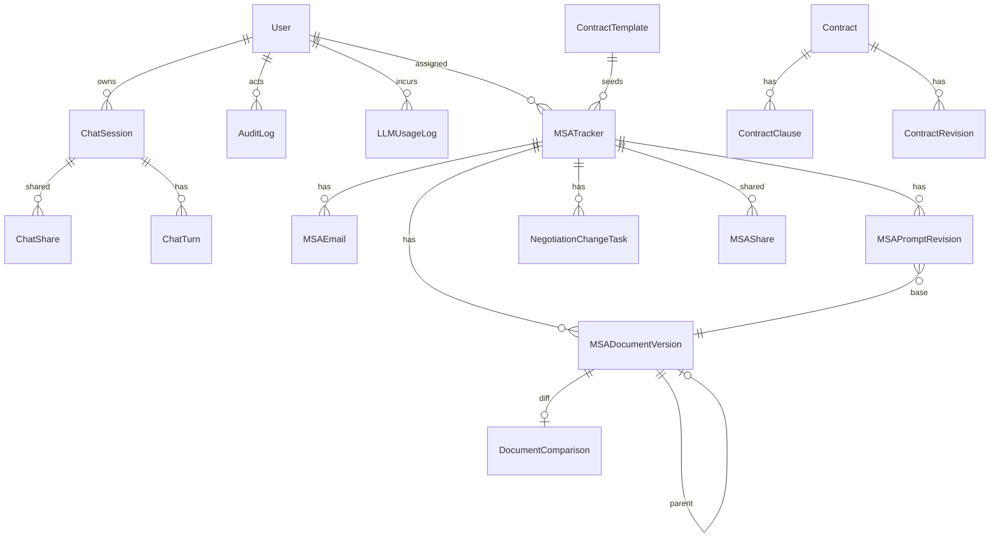
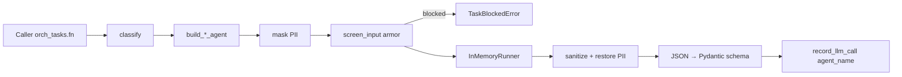
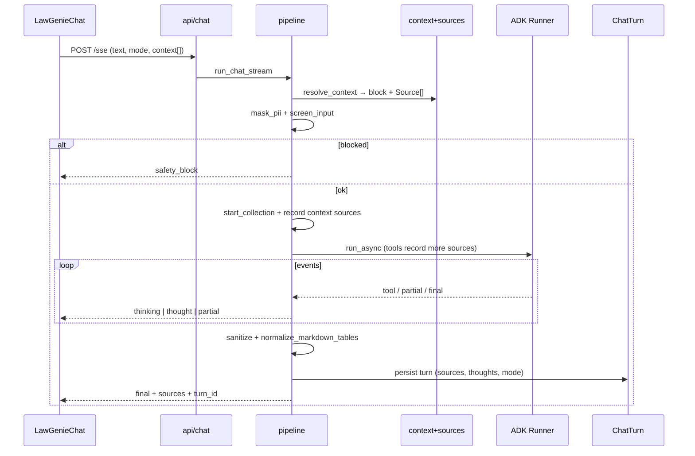
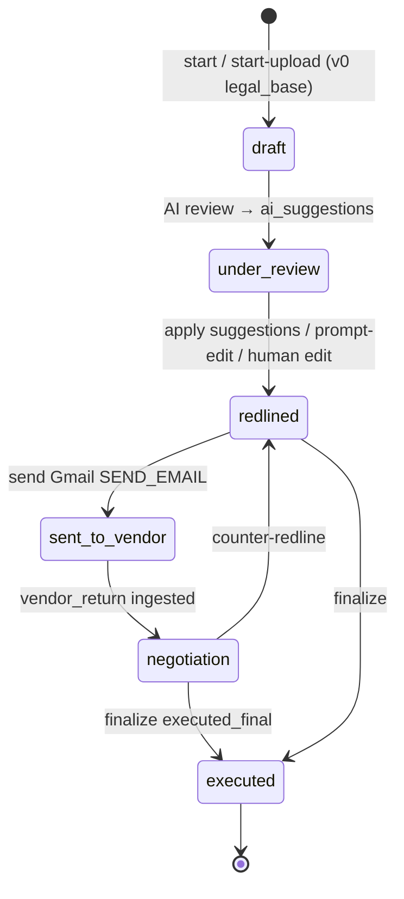
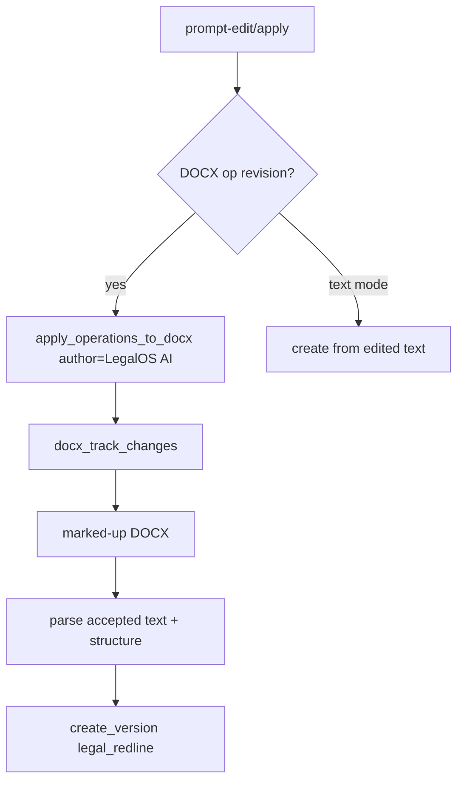

# LegalOS — Low-Level Design (LLD)

Companion to [ARCHITECTURE.md](./ARCHITECTURE.md). Layering, data model, orchestrator internals,
LawGenie grounding, APIs, configuration, and key algorithms — enough to implement, review, or
extend a module against the **current** codebase.

**Contents**

1. [Layering & conventions](#1-layering--conventions)
2. [Data model](#2-data-model)
3. [AuthN / AuthZ](#3-authn--authz)
4. [Orchestrator & AI](#4-orchestrator--ai)
5. [LawGenie chat deep dive](#5-lawgenie-chat-deep-dive)
6. [Citation, Evidence & document highlight](#6-citation-evidence--document-highlight)
7. [Markdown tables](#7-markdown-tables)
8. [MSA negotiation lifecycle](#8-msa-negotiation-lifecycle)
9. [Redline & change-history](#9-redline--change-history)
10. [Template library GCS & Vertex RAG](#10-template-library-gcs--vertex-rag)
11. [Other product modules](#11-other-product-modules)
12. [API surface](#12-api-surface)
13. [Frontend map](#13-frontend-map)
14. [Configuration](#14-configuration)
15. [Cross-cutting concerns](#15-cross-cutting-concerns)
16. [Quick onboarding checklist](#16-quick-onboarding-checklist)

---

## 1. Layering & conventions

```
backend/app/
  api/            FastAPI routers — auth, validation, thin orchestration
  core/           JWT/bcrypt, RBAC, GCP Secret Manager client
  models/         SQLAlchemy 2.0 ORM
  schemas/        Pydantic v2 request/response DTOs (REST)
  services/       business logic, storage, Gmail, MSA, DOCX, RAG, stubs, GCS
  orchestrator/   LegalAI home: chat pipeline, task agents, tools, prompts, sources
  adk/            thin ADK helpers: build_model(), sync _run_coro bridge
  main.py         app factory, lifespan, router registration

backend/adk_web/legalos_orchestrator/   optional `adk web` bootstrap (dev)
```

**Conventions**

| Rule | Practice |
|------|----------|
| DB session | `get_db()` yields `Session` per request (`autoflush=False`), closed in `finally` |
| Permissions | Handlers use `require_permission(Permission.X[, Y])` (OR). Exceptions: login, OAuth callback, OnlyOffice callback |
| Audit | State-changing / AI-invoking flows call `write_audit(...)` before commit |
| LegalAI calls | Product modules call `from app.orchestrator import tasks as orch_tasks` — **not** a provider SDK and **not** `get_ai_service()` |
| Prompts | All LegalAI prompts under `orchestrator/prompts/` (no `app/prompts/`) |
| Build Studio | Separate `services/agent_service.py` — not part of LegalAI orchestrator |

**Call pattern for structured AI**

```python
result = orch_tasks.review_contract(
    text,
    playbook,
    contract_type="MSA",
    module="msa_automation",
    operation="review_contract",
    user_id=user.id,
    db=db,
)
```

`task_runner` records usage (including `agent_name`); call sites do **not** wrap with
`usage_context` for LLM work.

---

## 2. Data model



### Domain groups

**Users / auth** — `User`: email, hashed_password, full_name, role, is_active, last_login_at.

**MSA / NDA automation**

| Model | Role |
|-------|------|
| `MSATracker` | Negotiation thread. Status: `draft → under_review → redlined → sent_to_vendor → negotiation → executed`. Holds `ai_suggestions`, `canonical_version_id`, `executed_version_id`, `gmail_thread_id`, `assigned_to_id` |
| `MSADocumentVersion` | Immutable version. Sources: `legal_base \| vendor_return \| legal_redline \| executed_final`. Blob via `storage_key`; `extracted_text` (accepted); DOCX `structure_snapshot` / `structure_hash` |
| `MSAPromptRevision` | Staged AI/text edit. `proposed → applied \| discarded`. Stores instruction, operations JSON, diff, `edit_mode` (`text \| docx_operations`) |
| `MSAEmail` | Vendor correspondence |
| `MSAShare` | Cross-user access |
| `NegotiationChangeTask` | Diff-derived actionable items |
| `NegotiationMemory` | Negotiation Q&A memory for context tools |

**Contracts (UC-01)** — `Contract` → `ContractClause` + `ContractRevision` (prompt-edit staging).

**Comparison (UC-02)** — `DocumentComparison`: `diff_blocks`, `risk_commentary`, `summary_report`, `llm_narrative`; reused by MSA version diffs.

**Templates** — `ContractTemplate`: `contract_type`, `name`, `template_text`, optional `storage_key` (GCS object path when uploaded via library).

**Knowledge** — `PlaybookClause`, `ClauseBankEntry`, `RegulatorySource`, `KnowledgeBaseEntry`.

**Chat (LawGenie)**

| Model | Table | Role |
|-------|-------|------|
| `ChatSession` | `chat_sessions` | Sidebar index; `session_id` matches ADK session id |
| `ChatShare` | `chat_shares` | Read-only share to another user |
| `ChatTurn` | `llm_turn_metrics` | One row per user→assistant exchange: query, response, tokens, latency, `sources` JSON, `thoughts` JSON, `mode`, feedback |

ADK conversation events live in ADK’s own Postgres tables via `DatabaseSessionService`;
`ChatTurn` is the app-facing durable log for replay, References, and metrics.

**Gmail / tasks** — `GmailCredential`, `GmailSettings`, `EmailDraft`, `Task`.

**Other** — `LegalBotQuery`, `ResearchNote`, `RegulatoryUpdate`, `TrackedSource`, `FeatureRequest`
(Build Studio), `Notification` / `NotificationSetting`, `AuditLog`, `LLMUsageLog` (includes
`agent_name`).

### `MSADocumentVersion` key columns

| Column | Notes |
|--------|-------|
| `version_number` | Monotonic per tracker |
| `source` | legal_base / vendor_return / legal_redline / executed_final |
| `extracted_text` | Accepted text (tracked changes resolved) |
| `storage_key` | Blob ref; marked-up DOCX preserved |
| `parent_version_id` | Version chain |
| `comparison_id` | Diff vs parent (circular FK via `use_alter`) |
| `structure_snapshot` / `structure_hash` | DOCX parts for operation planning |

---

## 3. AuthN / AuthZ

**JWT (`core/security.py`)**

- Access token: `{sub, iat, exp, role}`, HS256, `access_token_expire_minutes` (default 60).
- File download token: 4h, `purpose=file_download`, scoped to one `storage_key` (OnlyOffice / MSA files).
- Decode failures → 401.
- Refresh: `POST /api/auth/refresh` with sliding idle window from the frontend session helper.

**RBAC (`core/rbac.py`)**

Roles: `super_admin`, `legal_admin`, `legal_user`, `business_user`, `read_only`.

| Permission (selected) | super_admin | legal_admin | legal_user | business_user | read_only |
|-----------------------|:-----------:|:-----------:|:----------:|:-------------:|:---------:|
| MSA_AUTOMATION / CONTRACT_REVIEW | ✅ | ✅ | ✅ | ❌ | ❌ |
| APPROVE_AI_OUTPUT | ✅ | ✅ | ✅ | ❌ | ❌ |
| SEND_EMAIL | ✅ | ✅ | ❌ | ❌ | ❌ |
| USER_MANAGEMENT | ✅ | ❌ | ❌ | ❌ | ❌ |
| LEGAL_BOT_USE / TASK_MANAGEMENT | ✅ | ✅ | ✅ | ✅ | ❌ |
| LEGAL_NEWS_DIGEST | ✅ | ✅ | ✅ | ❌ | ✅ |
| PLAYBOOK_MANAGEMENT | ✅ | ✅ | ❌ | ❌ | ❌ |
| AUDIT_LOG_ALL | ✅ | ✅ | ❌ | ❌ | ❌ |
| BUILD_REQUESTS | ✅ | ✅ | ✅ | ❌ | ❌ |

UI sidebar + route guards use the same matrix (`frontend/src/lib/auth.ts`).

---

## 4. Orchestrator & AI

### 4.1 Package layout

```
orchestrator/
  rules.py              AgentId + classify(module, operation)
  tasks.py              Public API for structured LLM work
  task_runner.py        armor → ADK run → sanitize → metrics
  pipeline.py           LawGenie SSE (chat only)
  agent.py              Root chat agent + App (optional compaction)
  registry.py           agent_id → builder / schema
  metrics.py            task_usage + agent_name
  schemas.py            Pydantic output schemas for structured agents
  models.py             Wire DTOs: ContextRef, Source, Thought*, TurnOut, …
  sources.py            Request-scoped source sink (chunk-level)
  context.py            Resolve refs → prompt block + Source dicts
  attachments.py        In-memory upload text store
  sse.py                SSE frame helpers
  runtime.py            request_runtime contextvar (user_id, role)
  config.py             Orchestrator-specific settings mirror
  agents/
    builders.py         Task agents (review, edit, docx, gmail, qa, …)
    chat/               contract / compliance / discovery specialists
  tools/                jfpsl_rag, web_search, context_tools, datetime
  guardrails/           pii, armor
  prompts/              all chat + shared fragments + JFPSL standards MD
  memory/               CachingSessionService, turn_metrics persistence
  dependencies.py       Runner / session singletons
  access.py             Chat session ownership / share checks
```

Low-level ADK (kept thin):

```
adk/
  models.py   build_model() — Gemini direct or LiteLLM
  runner.py   _run_coro — sync bridge for InMemoryRunner
```

Dev-only ADK Web:

```
backend/adk_web/legalos_orchestrator/agent.py
  → re-exports build_root_agent / build_app
  → run: cd backend && adk web --port 8080 adk_web
```

### 4.2 Rule map (`rules._RULES`)

| module | operation | AgentId |
|--------|-----------|---------|
| msa_automation | review_contract | msa_review |
| msa_automation | vendor_review | msa_review |
| msa_automation | prompt_edit | msa_edit |
| msa_automation | compare_documents | msa_change_summary |
| contract_review | review_contract | contract_review |
| contract_review | prompt_edit | msa_edit |
| gmail | generate_reply / regenerate_reply / autodraft_reply | gmail_reply |
| tasks | extract_from_email | email_tasks |
| legal_bot | answer_query | legal_qa |
| legal_research | generate_research_note | research |
| legal_news | analyse_regulatory_update / save_discovered | news_analysis |

Chat specialist ids (`contract_agent`, `compliance_agent`, `discovery_agent`) are **not**
selected via `classify`.

### 4.3 `tasks.py` public functions

| Function | LLM? | Notes |
|----------|------|-------|
| `review_contract` | yes | Playbook-grounded clause review |
| `edit_document` | yes | Full-text prompt edit |
| `plan_docx_operations` | yes | Structured DOCX ops against anchors |
| `generate_email_reply` | yes | Gmail draft |
| `extract_tasks_from_email` | yes | Task Manager ingest |
| `answer_legal_bot` | yes | Optional `document_text` / memory |
| `generate_research_note` | yes | Research notes |
| `analyse_regulatory_update` | yes | News classify/summarize |
| `summarize_document_changes` | yes | Negotiation narrative over diffs |
| `compare_documents` | **no** | difflib-style stub |
| `score_task_priority` | **no** | Heuristic stub |
| `model_version` | — | Label for persisted rows |

When `AI_BACKEND=stub` (or agent throws), LLM functions return `StubLegalAIService` shapes from
`services/ai_service.py`.

### 4.4 Task runner flow



Ask-AI-to-Edit call sites additionally run `services/edit_instruction.py`:

- Reject empty / trivial (e.g. lone `.`) instructions with HTTP 400  
- Screen jailbreaks / fiction / role-play; re-raise blocks (do not fall through to stub)  
- Agents get stronger edit prompts; stub no-op when instruction is non-actionable  

### 4.5 Model routing (`adk/models.py`)

| `ADK_MODEL` | Provider |
|-------------|----------|
| `gemini-2.5-flash` (no slash) | Gemini API key |
| `ollama/llama3`, `openai/...` | LiteLLM → `ADK_LITELLM_API_BASE` |

`AI_BACKEND` only toggles stub vs “run ADK”. There are no separate Gemini/Ollama **service classes**.

### 4.6 What was removed (consolidation)

- `services/gemini_ai_service.py`, `services/adk_ai_service.py`
- `get_ai_service()` factory and `OllamaLegalAIService`
- `app/adk/agents.py`, `app/adk/schemas.py` (moved under orchestrator)
- `app/prompts/` → `orchestrator/prompts/`
- Chat agents: `orchestrator/sub_agents/` → `orchestrator/agents/chat/`

---

## 5. LawGenie chat deep dive

### 5.1 Entry points

| Endpoint | Role |
|----------|------|
| `POST /api/chat/sse` | Streaming turn (primary UX) |
| `POST /api/chat/` | Non-streaming fallback (`run_chat_once`) |
| `POST /api/chat/attachments` | Upload → parse → attachment_id |
| Session CRUD / share / export / feedback | Sidebar + ratings |

Mounted only when `ORCH_ENABLED=true`.

### 5.2 Modes (`pipeline._MODE_DIRECTIVES`)

| Mode | Behavior |
|------|----------|
| **review** (default) | Prefer attached docs + JFPSL RAG; lean web |
| **research** | Broad web + cites; JFPSL secondary; Thoughts plan step |
| **draft** | Produce drafts from templates / attachments |

### 5.3 Turn sequence



### 5.4 Context refs (`orchestrator.models.ContextRef`)

| kind | Fields | Resolution |
|------|--------|------------|
| `msa_version` | tracker_id, version_id? | Access-checked MSA extracted text |
| `gmail_thread` | gmail_thread_id | `gmail_service.thread_as_text` |
| `attachment` | attachment_id | In-memory attachment store |
| `kb_entry` | kb_entry_id | KnowledgeBaseEntry |

`context.resolve_context` returns `(numbered_prompt_block, source_dicts)`. Sources are chunked
(~1.8k chars, paragraph-aware, max 6 per ref) with estimated `page` and `kind=attachment`.
Pipeline records them **after** `start_collection()` so they occupy `[1]…[k]` first.

### 5.5 Chat specialists & tools

| Agent | Focus | Tools |
|-------|-------|-------|
| `contract_agent` | MSA/NDA/clause | JFPSL RAG, regulatory RAG, web_search, web_fetch, get_msa_document, datetime |
| `compliance_agent` | RBI/DPDP/SEBI/… | regulatory RAG, JFPSL RAG, web_search, web_fetch, datetime |
| `discovery_agent` | General | JFPSL RAG, regulatory RAG, web_search, web_fetch, get_gmail_thread, datetime |

Research mode (when `ORCH_RESEARCH_FANOUT_ENABLED`) runs parallel retrieval via
`research_fanout.py` before the agent; optional `ORCH_RESEARCH_VERIFY_ENABLED` audits
citations (`groundedness.py`). Composer modes Review / Research / Draft are directives
plus hard web-tool gating in `runtime.py`.

Root agent (`orchestrator/agent.py`) transfers among these. Prompts compose from
`static_header`, `persona_and_mission`, `routing_policy`, `retrieval_policy`,
`response_style`, `conversation_flow`, `safety_compliance_and_guardrails`, plus distilled
`jfpsl_template_standards.md`.

### 5.6 SSE frames (`orchestrator/sse.py`)

| Frame | Payload highlights |
|-------|--------------------|
| `thinking` | Status string |
| `thought` | Structured Thoughts step (plan / search / links / documents / status) |
| `partial` | Streaming answer text |
| `final` | Full text, `sources`, `thoughts`, `turn_id`, optional headline |
| `safety_block` | Refusal |
| `error` | Failure message |

### 5.7 Frontend UX (`LawGenieChat.tsx`)

- Composer modes, attachments, seeded MSA/Gmail context chips  
- **Stop** — AbortController cancels the SSE reader; keeps partial answer  
- **Mic STT** — Web Speech API (`SpeechRecognition` / `webkitSpeechRecognition`)  
- Thoughts panel (research expands when answer lands)  
- References list + cite chips → Evidence + DocumentViewer  
- Share session, feedback up/down + comment, turn export  

---

## 6. Citation, Evidence & document highlight

### 6.1 `Source` wire contract

Backend `orchestrator.models.Source` / frontend `ChatSource`:

| Field | Notes |
|-------|-------|
| `kind` | `web` \| `template` \| `executed` \| `attachment` |
| `title`, `url`, `snippet`, `site` | List / chip UX |
| `storage_key`, `page` | Library preview + Page N label |
| `chunk_id` | Stable id; dedupe key (`sources.collected_sources`) |
| `chunk_text` | Fuller excerpt (~4k) for Evidence / highlight |
| `attachment_id`, `label` | Uploads |

`make_chunk_id(prefix, *parts)` → `prefix:sha1[:12]`. Legacy turns without chunk fields still
render; Evidence falls back to `snippet` / title.

### 6.2 Who records sources

| Producer | Behavior |
|----------|----------|
| `context.py` | Attachment / MSA / Gmail / KB chunks first |
| `jfpsl_rag_service` | Absolute cite indices; `chunk_text`, page, `storage_key` when resolvable |
| `web_search` | One source per result; absolute indices after prior sources |

Dedupe is **chunk-level** so multiple hits from one MSA stay separate `[n]`s.

### 6.3 Rendering & click path

1. `Markdown.tsx` runs `normalizeMarkdownTables` then `linkifyCitations`  
   - `[n]` → `[Page N](legalos://source/n)`  
   - Also maps `[JFPSL template]` / `**JFPSL template**` / attached / web labels to first matching kind  
2. Custom `a` renderer → `.cite-chip` button → `onOpenSource(index)`  
3. `openEvidence` → Evidence panel (bot claim paragraph vs marked chunk)  
4. Simultaneously open / jump DocumentViewer when `storage_key` (or title→library resolve) exists  
5. Jump: `scrollToPage` then `scrollToText` with 60–120 char needle from `chunk_text`

Library preview: `GET /api/contract-templates/library/preview` + `/library/file`.

---

## 7. Markdown tables

Models often emit **invalid GFM** (header + separator collapsed on one line; bare `---` rows).
`remark-gfm` then shows raw pipes.

| Layer | Path | When |
|-------|------|------|
| Backend | `services/markdown_tables.py` | Repair + `iter_content_segments` for DOCX |
| Chat | `pipeline.py` | Partial + final text |
| Ask AI to Edit | `api/msa_automation.py`, `api/contract_review.py` | edited_text, summaries, ops |
| Document export | `document_parser.py` | Real tables in DOCX/PDF |
| Frontend | `lib/markdownTables.ts` → `Markdown.tsx` | Stream / legacy turns |

Normalizer responsibilities:

- Split collapsed `| A | B | | :--- | :--- |` into header + separator  
- Drop bare dash noise adjacent to tables  
- Pad ragged columns; always emit a valid separator row  

Prompt (`response_style.py`) requires each table row on its own line.

---

## 8. MSA negotiation lifecycle



**Version creation** is centralized in `msa_version_service.create_version(...)`:

1. Next `version_number`, link `parent_version_id`  
2. Persist blob + `extracted_text` + structure snapshot/hash  
3. Optionally compare vs parent → `DocumentComparison` + `NegotiationChangeTask`s  
   (`orch_tasks.compare_documents` + `summarize_document_changes`)  
4. Vendor return may run `orch_tasks.review_contract` (operation `vendor_review`)  
5. Audit log  

Editing entry points (OnlyOffice callback, `prompt-edit/apply`, suggestions/human-edit apply)
funnel into `create_version` with `source="legal_redline"`.

Gmail: watched threads / labels can auto-ingest vendor DOCX (`msa_gmail_ingest_service`) and
autodraft replies (`gmail_poll_service` → `orch_tasks.generate_email_reply`). DNS for Gmail from
Docker uses host gateway (`extra_hosts`); avoid custom compose DNS that breaks
`host.docker.internal` for Postgres.

---

## 9. Redline & change-history

**Goal:** every AI or human edit is both (a) a new immutable version and (b) native,
author-attributed OOXML tracked changes the vendor can review in Word/OnlyOffice.

### 9.1 Human edits (OnlyOffice)

- `onlyoffice_service.build_editor_config()` sets `editorConfig.user.name = user.full_name`.  
- When `onlyoffice_force_track_changes` is on, Track Changes is locked on.  
- Document server POSTs marked-up DOCX to `/api/onlyoffice/callback` → new `legal_redline` version.  

### 9.2 AI edits (structured operations)

`docx_operation_service.apply_operations_to_docx(..., author=...)`:

- `author=None` → in-place overwrite (legacy)  
- `author` set → `_apply_operations_tracked` via `docx_track_changes`  
  Apply path uses `author = "LegalOS AI (<model_version>)"` when track-changes forced.  

| Primitive | Markup |
|-----------|--------|
| `replace_span_tracked` | strike matched span (`w:del`), insert (`w:ins`) |
| `replace_paragraph_tracked` | strike all runs, append `w:ins` |
| `delete_paragraph_tracked` | wrap in `w:del` / `w:delText` |
| `mark_paragraph_inserted` | wrap in `w:ins` |

Revision ids seed above max existing id so AI and human revisions do not collide. Inserts apply
bottom-up by paragraph index to avoid drift.



### 9.3 DOCX operation schema (AI edit)

`plan_docx_operations` receives document **parts** (stable `anchor_id`s from
`docx_structure_service`) and returns ops shaped like:

```json
{
  "op_type": "replace_span|replace_clause|insert_clause|delete_clause|add_definition",
  "anchor_id": "body:p:12",
  "after_anchor_id": null,
  "target_text": "limited to fees paid",
  "content": "mutual and capped at 2x fees",
  "description": "make liability cap mutual",
  "confidence": 0.82
}
```

### 9.4 Accepted-text extraction

Tracked inserts live under `<w:ins>`; deletions under `<w:delText>`. python-docx `paragraph.text`
misses nested inserts. `document_parser.accepted_paragraph_text` walks document order:

- `<w:t>` kept, `<w:delText>` skipped, tabs/breaks normalized  

Used by `_parse_docx` and `docx_structure_service` so `extracted_text` / in-app diffs stay clean
while the blob keeps full redline. Table segments from markdown go through `iter_content_segments`.

### 9.5 Provenance

- `MSAPromptRevision.operation_results` — per-op `applied | failed | manual_required`  
- `AuditLog` — `msa_onlyoffice_saved`, `msa_prompt_edit_applied`, `msa_suggestions_applied`, etc.  

> Follow-up: `suggestions/apply` may still produce clean (non-redline) text; a unified
> `ChangeEntry` history would consolidate op results + diffs.

---

## 10. Template library GCS & Vertex RAG

### 10.1 GCS library

| Item | Value |
|------|-------|
| Service | `services/gcs_template_library.py` |
| API | `GET /library`, `GET /library/preview`, `GET /library/file`, `POST /library/upload`, `GET /library/categories` |
| UI | `/contract-templates` |
| Templates URI | `gs://legalos/legal_templates/…` |
| Executed URI | `gs://legalos/contracts/…` |
| Env | `LEGAL_TEMPLATES_BUCKET`, `LEGAL_TEMPLATES_PREFIX`, `LEGAL_CONTRACTS_PREFIX` |

**Categories:** `doc_kind` = `template` \| `executed`; `contract_type` =
`MSA` \| `NDA` \| `SLA` \| `Employment` \| `Policy` \| `Other`. Files: `.docx`, `.pdf`, `.txt`.

**Upload:** write GCS object + metadata; if text parses, also insert `ContractTemplate` with
`storage_key` and `template_text` (“Use in negotiation”).

`resolve_library_key_from_rag(display_name, source_uri)` maps Vertex hits → `(kind, storage_key)`
for in-app preview.

### 10.2 Vertex RAG sync

| Script | Input |
|--------|-------|
| `scripts/sync_templates_to_rag.py` | `Templates/` |
| `scripts/sync_contracts_to_rag.py` | `contracts/` |
| `scripts/distill_template_playbook.py` | Builds `jfpsl_template_standards.md` |

Upload state (gitignored): `backend/config/.rag_upload_state.json`,
`.rag_contracts_upload_state.json`.

> **Call shape matters.** `top_k` goes on the *query*, not inside `VertexRagStore` — the API
> rejects `rag_retrieval_config` there with `400 INVALID_ARGUMENT`, and
> `jfpsl_rag_service` swallows the error, so a malformed call silently degrades every answer
> to web snippets. There is no public module for `RagQuery`, so it is passed as a dict.
> `tests/test_jfpsl_rag_service.py` pins this.

### 10.3 Regulatory knowledge corpus (the law)

A second, **Postgres-authoritative** corpus holding statutes, master directions and
circulars chunked by provision, so answers cite "Para 5.3" rather than "Page 4". Vertex RAG
cannot do this itself: its import API only chunks by fixed length and `RagQuery` has no
metadata filter.

| Piece | Location |
|--------|----------|
| Manifest (gate — nothing ingests without a row) | `backend/config/REGULATORY_CORPUS_MANIFEST.csv`, `services/regulatory_manifest.py` |
| Tables | `models/regulatory_corpus.py` → `regulatory_documents`, `regulatory_chunks` |
| Clause chunking | `services/clause_chunker.py` (per-`doc_type` header patterns) |
| Embeddings | `services/embedding_service.py` — `gemini-embedding-001` @768 dims, **L2-normalized** |
| Ingest | `services/regulatory_ingest_service.py`; CLI `scripts/sync_regulatory_to_rag.py`; API `api/regulatory_corpus.py`; UI `/regulatory-corpus` |
| Retrieval | `services/regulatory_rag_service.py` (keyword + semantic + optional Vertex, fused by RRF) |
| Routing | `services/regulatory_router.py` (deterministic, no LLM) |
| Agent tool | `orchestrator/tools/regulatory_rag.py` → `search_regulatory_knowledge` |
| Optional Vertex recall | `services/regulatory_vertex_recall.py` (one file per doc, off by default) |

**Retrieval order (LawGenie):** `search_regulatory_knowledge` (the law) →
`search_jfpsl_knowledge` (our templates) → `web_search`/`web_fetch` for very recent items →
cite by provision. See `prompts/retrieval_policy.py`.

`regulatory_chunks.tsv` is a Postgres **stored generated column** with a GIN index, and is
deliberately unmapped in the ORM (Postgres writes it; mapping `TSVECTOR` would break
`create_all` on the SQLite unit tests). Similarity is a cached numpy matmul because
**pgvector is not available** on this instance.

The **as-of / supersession filter** drops superseded and not-yet-effective documents unless
the question asks about historical law — this is what stops the bot citing repealed rules
that stay in the corpus for history.

Full design of record, including what was deliberately not built:
`docs/RAG_AND_RESEARCH_ARCHITECTURE.md §8`.

---

## 11. Other product modules

| Module | Flow | Key tables / notes |
|--------|------|--------------------|
| **UC-01 Contract Review** | upload → `review_contract` vs playbook → clause decisions → finalize; prompt-edit via `ContractRevision` + edit screening | `Contract*` |
| **UC-02 Doc Comparison** | two texts → `compare_documents` (deterministic) | `DocumentComparison` |
| **UC-03 LegalBot API** | `POST /ask` → `answer_legal_bot` (+ optional MSA/Gmail context) | `LegalBotQuery`; UI superseded by LawGenie |
| **UC-04 Legal Research** | query → `generate_research_note` | `ResearchNote`; API live |
| **UC-06 Legal News** | scrape / discover / ingest → `analyse_regulatory_update` | `RegulatoryUpdate`, `TrackedSource` |
| **Task Manager** | manual / email / aggregation; extract via orchestrator; priority via stub heuristics | `Task`, `EmailDraft` |
| **Playbook / clause bank** | CRUD gold positions + reusable clauses | `PlaybookClause`, `ClauseBankEntry` |
| **LawGenie chat** | SSE multi-agent + Evidence | `ChatSession`, `ChatTurn` |
| **Build Studio** | feature → stub PR agent → approve | `FeatureRequest` — **not** orchestrator |
| **Metrics** | usage aggregates by module / agent / user | `LLMUsageLog`, turn metrics |
| **Notifications** | SMTP outbox + prefs | `Notification*` |

---

## 12. API surface

Base prefix `/api`. Bearer JWT + permission unless marked public. Chat router mounts only when
`ORCH_ENABLED=true` (default).

| Router | Notable endpoints | Permission |
|--------|-------------------|------------|
| auth | `POST /login` (public), `/refresh`, `/accept-invite`, `GET /me` | — / authed |
| users | `GET/POST /`, `PATCH /{id}`, invite | USER_MANAGEMENT |
| contract-review | CRUD, clause decision, prompt-edit, revisions apply | CONTRACT_REVIEW / APPROVE_AI_OUTPUT |
| document-comparison | `POST /`, `GET /{id}` | DOCUMENT_COMPARISON |
| legal-bot | `POST /ask`, escalations, override | LEGAL_BOT_USE / APPROVE_AI_OUTPUT |
| **chat** | sessions, `POST /sse`, attachments, share, feedback, turn export | LEGAL_BOT_USE |
| legal-research | `POST /`, `PATCH /{id}` | LEGAL_RESEARCH |
| **msa** | start[/upload], versions, prompt-edit[/apply], suggestions, human-edit, changes, compare, tasks, finalize, send, OnlyOffice config, files | MSA_* / APPROVE / SEND_EMAIL |
| onlyoffice | `POST /callback` | Document Server JWT |
| gmail | status, OAuth, settings, drafts, poll | MSA / task perms |
| tasks | CRUD, ingest-email, daily-brief, aggregate | TASK_MANAGEMENT |
| **contract-templates** | DB CRUD; **`/library`**, preview, file, upload, categories | MSA / PLAYBOOK |
| legal-news | list, triage, discover, ingest, tracked sources, refresh | LEGAL_NEWS_* |
| playbook / clause-bank | clauses, sources, KB | PLAYBOOK / module |
| notifications | settings + list | authed |
| audit | `GET /` | AUDIT_LOG_OWN / ALL |
| metrics | summary, trends, users | AUDIT_LOG_ALL |
| build-studio | requests, approve-pr, reject | BUILD_* |

Health: `GET /health` (includes `ai_backend`).

---

## 13. Frontend map

| Route | Component | Notes |
|-------|-----------|-------|
| `/login`, `/accept-invite` | Login, AcceptInvite | |
| `/` | Dashboard | |
| `/jiolegal` | **LawGenieChat** | SSE, Evidence, STT, Stop, modes |
| `/msa-automation/*` | MSAAutomation | Deep-links to LawGenie with context |
| `/contract-templates` | ContractTemplates | GCS library + upload |
| `/contract-review/*` | ContractReview | Ask AI to Edit + RedlinePreview |
| `/document-comparison/*` | DocumentComparison | |
| `/tasks` | TaskManager | |
| `/playbook` | PlaybookManagement | |
| `/legal-news/*` | LegalNews | |
| `/settings` | Settings | Gmail + notification prefs |
| `/audit`, `/metrics`, `/users` | admin | |
| `/build-studio/*` | BuildStudio | |

**Key components**

| Component | Path | Role |
|-----------|------|------|
| Markdown | `components/Markdown.tsx` | GFM, table normalize, cite chips |
| DocumentViewer | `components/DocumentViewer.tsx` | PDF/DOCX/text; page + text highlight |
| OnlyOffice panels | `OnlyOfficeEditor`, `MSAOnlyOfficePanel`, … | Live DOCX |
| API / SSE | `lib/api.ts` | Fetch + abortable SSE reader |
| Auth | `contexts/AuthContext.tsx`, `lib/auth.ts`, `lib/session.ts` | JWT + sliding refresh |

`LegalBot.tsx` / `LegalResearch.tsx` may exist on disk but are **not** mounted in `App.tsx`.

---

## 14. Configuration

`app/config.py` (pydantic-settings) + orchestrator overlay. Important groups:

| Group | Settings |
|-------|----------|
| Core / DB | `database_url`, `jwt_secret`, `jwt_algorithm`, `access_token_expire_minutes` |
| AI switch | `ai_backend` (`stub` \| `adk`), `model_version` |
| ADK model | `adk_model`, `adk_temperature`, `adk_litellm_api_base`, `adk_litellm_api_key` |
| Gemini (dev) | `gemini_api_key`, `gemini_model`, `gemini_temperature` |
| GCP | `legalos_env`, `gcp_project_id`, `gcp_secret_name`, `gcp_service_account_file` |
| Storage | `local_storage_path`, `max_upload_bytes`, MSA GCS prefix when used |
| Template GCS | `legal_templates_bucket`, `legal_templates_prefix`, `legal_contracts_prefix` |
| Orchestrator | `orch_enabled`, armor, PII, web search, RAG, compaction, history, artifacts, max context chars |
| Vertex RAG | `vertex_rag_corpus_id`, `vertex_rag_location`, `templates_dir` |
| Web search | `web_search_enabled`, Google CSE key/id or DuckDuckGo fallback |
| OnlyOffice | `onlyoffice_enabled`, JWT/URLs, `onlyoffice_force_track_changes` |
| Gmail | client id/secret, redirect, label, poll interval, enabled |
| Notifications | SMTP / enabled flags |
| News | scrape interval / enabled |
| CORS | `cors_origins` |

Env templates: `config/legalos-secret.{dev,uat,prod}.json`. Helm injects `LEGALOS_ENV` and mounts
`legalos-secret`.

---

## 15. Cross-cutting concerns

- **Migrations** — Alembic on container boot (`alembic upgrade head`). Startup seeds idempotent
  reference data only. Never auto-create tables from models in prod.
- **Usage governance** — orchestrator task runs and chat turns stamp `module` / `operation` /
  `agent_name` on `llm_usage_logs` / `llm_turn_metrics`. Prefer provider token counts; fall back
  to char estimate.
- **Audit & retention** — `AuditLog` append-only; 7-year retention target (RBI).
- **Safety stack** — input armor + PII mask/restore on chat and tasks; edit_instruction screening
  on prompt-edit; output sanitize strips internal agent/tool names; optional DLP hooks via config.
- **Resilience** — ADK failures → stub fallback for structured tasks; OnlyOffice/Gmail/news loops
  are feature-flagged; Gmail DNS retries; compose `extra_hosts: host.docker.internal:host-gateway`.
- **Data residency** — prod inference via LiteLLM on-prem; Gemini-direct for pilot; blobs in
  JFPSL-controlled FS/GCS; PII masking before external calls when enabled.
- **Idempotent keys** — OnlyOffice `document_key` content-hash based; storage keys UUIDs;
  DOCX `structure_hash` deterministic; RAG upload state files.
- **Testing** — `backend/tests` (docx, suggestions, prompt revisions, **markdown_tables**, …).
  Run pytest in the backend venv with `AI_BACKEND=stub` for offline CI.

---

## 16. Quick onboarding checklist

1. Read [ARCHITECTURE.md](./ARCHITECTURE.md) §5 (AI) and this LLD §4–§7 (orchestrator, chat,
   citations, tables).
2. Trace MSA review:  
   `api/msa_automation.py` → `orch_tasks.review_contract` → `rules.classify` → `build_review_agent` → `task_runner`.
3. Trace LawGenie: `api/chat.py` → `pipeline.py` → `context`/`sources` → chat specialists + tools →
   Evidence UI.
4. Trace Ask AI to Edit: `edit_instruction` → `plan_docx_operations` / `edit_document` →
   `markdown_tables` → apply / redline.
5. For templates: `gcs_template_library.py` + RAG sync scripts + Template Library UI.
6. For redlines: LLD §9 + `docx_operation_service` / `docx_track_changes`.
7. Confirm env: `AI_BACKEND`, `ADK_MODEL`, GCP SA / secrets, `LEGAL_TEMPLATES_*`,
   `VERTEX_RAG_*`, OnlyOffice, Gmail, `ORCH_*`.
