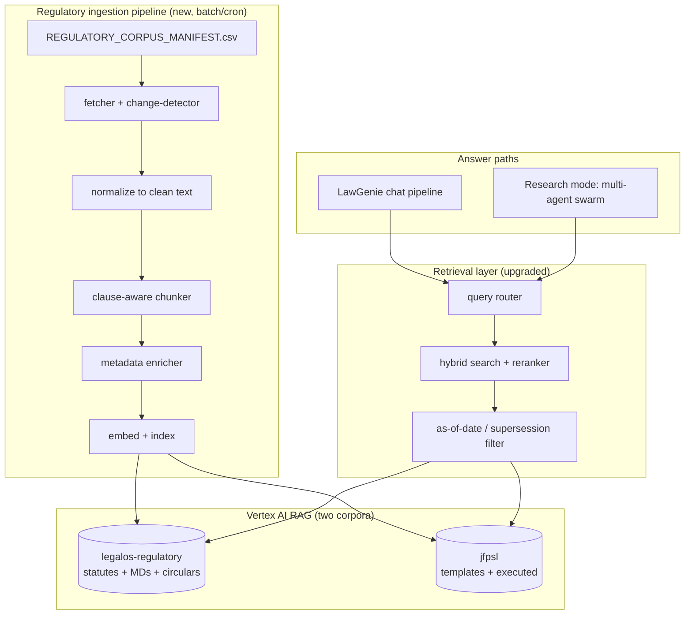
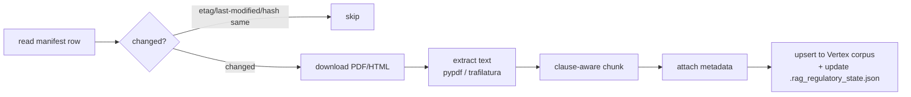
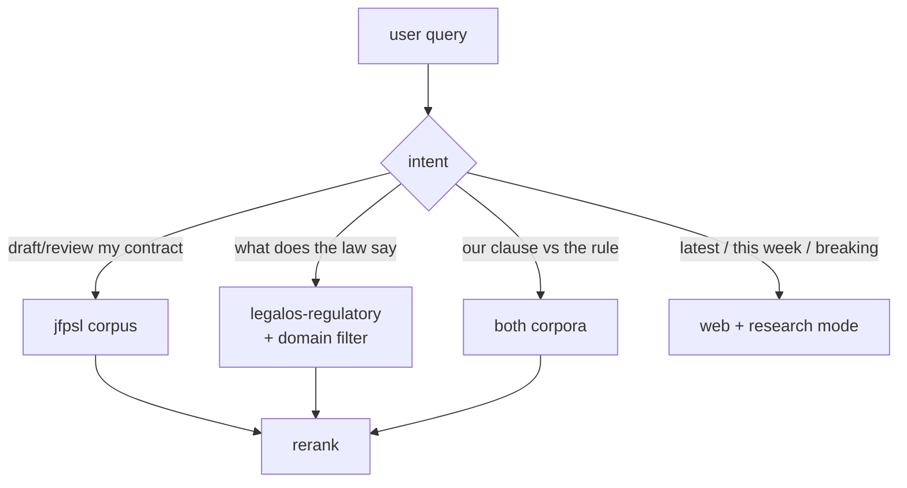
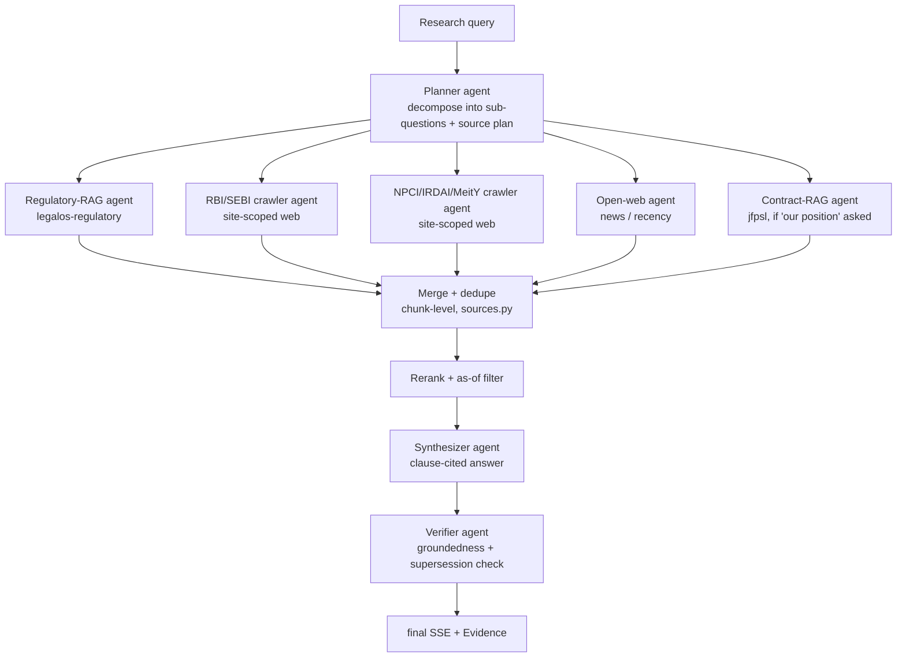

# LegalOS — Regulatory Knowledge RAG & Multi-Agent Research Architecture

> Companion to `ARCHITECTURE.md` and `LOW_LEVEL_DESIGN.md`.
> Goal: make **LegalBot / LawGenie** give *detailed, accurate, clause-cited* answers on Indian
> financial-services law, and add a **parallel multi-agent Research mode** that crawls authoritative
> sources on demand.

> ## ⚠️ Implementation status (read this first)
>
> Phases 1–3, 5 and the eval harness are **built**; Phase 4 shipped as a parallel
> *retrieval* fan-out rather than an agent chain. Two findings during implementation
> changed the design from what §1–§4 below propose — the sections are kept for the
> reasoning, but **§8 "What was actually built" is the current design of record.**
>
> 1. **Retrieval was broken, not just thin.** `search_jfpsl_corpus` passed
>    `rag_retrieval_config` inside `VertexRagStore` and imported the non-existent
>    `agentplatform.types`, so every call returned `400 INVALID_ARGUMENT`, was
>    swallowed by its `except`, and fell through to web snippets. Fixed first.
> 2. **Vertex RAG cannot produce clause citations.** Its import API supports only
>    `fixed_length_chunking`, and `RagQuery` exposes no metadata filter. Clause
>    chunking, `section_label` citations and as-of/supersession filtering therefore
>    live in Postgres; Vertex is an optional document-level recall channel.

---

## 0. Diagnosis — why answers are shallow today

From `LLD §10.2` and `ARCHITECTURE §5.6`, LawGenie's retrieval order is:

```
search_jfpsl_knowledge (Vertex RAG)  →  web_search if empty  →  cite
```

The Vertex corpus contains **only** `gs://legalos/legal_templates/` + `gs://legalos/contracts/`
(JFPSL's own templates and executed contracts — `LLD §10.1`). It contains **no statutes, no RBI
Master Directions, no SEBI/IRDAI/NPCI text.**

So for a question like *"what is the cooling-off period under RBI digital-lending rules"*:

1. `compliance_agent` calls `search_jfpsl_knowledge` → **no relevant chunk** (corpus has none).
2. Falls through to `web_search` → DuckDuckGo/CSE **snippets** (one `Source` per result, `LLD §6.2`),
   ~200 chars each, no clause numbers, frequently blog/aggregator pages.
3. Model answers from thin, ungrounded snippets → vague, sometimes wrong, no authoritative citation.

**The corpus is the bottleneck, not the model.** Everything below fixes that, then hardens retrieval,
then adds the research swarm.

A second, structural problem: **regulation churns fast.** In 2025–26 alone the plan doc's own targets
moved —

| Plan-doc entry | Current authoritative text | Changed |
|---|---|---|
| "Digital Lending Master Direction" | RBI (Digital Lending) Directions, **2025** (8 May 2025) | repealed 2022 guidelines |
| "DPDP Act 2023" | DPDP **Rules, 2025** (G.S.R. 846(E), 13 Nov 2025) | Act now enforceable in phases |
| "SEBI (Mutual Funds) Regulations" | SEBI (MF) Regulations **2026** + Master Circular **20 Mar 2026** | 1996 regs replaced |

A corpus loaded once and forgotten will serve **repealed law**. The design therefore treats
freshness and supersession as first-class, not an afterthought.

---

## 1. Target architecture at a glance



Two changes to your mental model:

- **Two corpora, not one.** `jfpsl` stays exactly as-is (contract drafting/review grounding).
  A new `legalos-regulatory` corpus holds the *law*. They have different chunking, metadata, and
  refresh needs, and mixing them dilutes retrieval quality for both.
- **A retrieval layer** sits in front of both (router → hybrid+rerank → as-of filter) instead of the
  current "RAG then web" fallback.

---

## 2. The regulatory corpus

### 2.1 Source manifest

Ship `REGULATORY_CORPUS_MANIFEST.csv` (delivered alongside this doc) into
`backend/config/`. It is the single source of truth for what the corpus contains. Columns:

| Column | Purpose |
|---|---|
| `doc_id` | Stable id, used as chunk-id prefix and citation anchor |
| `domain` | `payments_banking` / `lending_credit` / `investments_wealth` / `insurance` / `data_privacy_cyber` / `aml_kyc` / `consumer_protection` |
| `title`, `issuer`, `doc_type` | Display + filtering (`bare_act` / `master_direction` / `regulation` / `circular` / `rules` / `scheme`) |
| `canonical_url` | Official government/regulator URL — the only place to fetch from |
| `version_or_effective` | Effective date or `check-latest` for living documents |
| `supersedes` | What this replaces — drives the supersession filter (§4.3) |
| `update_cadence` | `stable` (bare Acts) / `on-change` / `monthly` / `quarterly` — drives the refresh scheduler |
| `priority` | `P1` load first (highest JioFinance relevance) → `P3` |
| `corpus` | `legalos-regulatory` |
| `tags` | Retrieval hints (e.g. `kfs;cooling-off;dlg;lsp`) |

**Sourcing principle (from your own plan doc, and correct):** ingest **official primary sources only**
— India Code for bare Acts, rbi.org.in / sebi.gov.in / irdai.gov.in / npci.org.in / meity.gov.in for
regulator text. Do **not** ingest Taxmann/EBC/law-firm commentary into the corpus: it is copyrighted,
and it makes the bot paraphrase someone's opinion instead of citing the primary rule. Commentary can
live in a human's reading list, not the RAG.

**P1 (load these first — they carry most JioFinance query volume):**
Digital Lending Directions 2025 · RBI KYC Master Direction · PPI Master Direction · Payment Aggregator
directions · NPCI UPI circulars · PMLA 2002 · DPDP Act 2023 + DPDP Rules 2025 · SEBI (MF) Regulations
2026 + MF Master Circular · Payment & Settlement Systems Act 2007 · NBFC Fair Practices Code.

> Note on fetching: your sandbox/CI egress is locked to package registries, so the fetcher must run
> where it can reach the `*.gov.in` / `rbi.org.in` / `npci.org.in` hosts (the same place
> `scripts/sync_*_to_rag.py` already runs). The manifest is host-agnostic; only the fetcher needs
> egress.

### 2.2 Ingestion pipeline (new script family)

Mirror the existing `scripts/sync_*_to_rag.py` pattern with a third:
`scripts/sync_regulatory_to_rag.py`. Stages:



- **Change detection.** Store `etag` / `last-modified` / SHA-256 per `doc_id` in
  `backend/config/.rag_regulatory_state.json` (same gitignored-state pattern as `LLD §10.2`). For
  `check-latest` living docs (KYC MD, master circulars, NPCI), diff the hash on every scheduled run and
  re-index only on change. This is what stops the corpus from serving repealed rules.
- **Scheduler.** Reuse the lifespan loop machinery from `ARCHITECTURE §3` (the same place the Gmail
  poll / news scrape loops start). Cadence from the manifest: `stable` = never auto (manual on
  amendment), `quarterly`/`monthly` = periodic hash-diff, `on-change` = webhook or daily diff.

### 2.3 Clause-aware chunking (the single biggest accuracy lever)

Legal text has structure the current ~1.8k-char paragraph chunker (`LLD §5.4`) throws away. A chunk
that splits Section 6(2)(b) mid-sentence can never be cited as "Section 6(2)(b)". Chunk on the
**legal hierarchy**, not character count:

- Detect `Section` / `Regulation` / `Clause` / `Paragraph` / `Rule` headers with regex per `doc_type`
  (RBI MDs use `para N.N`; SEBI circulars use `clause N.N`; bare Acts use `Section N`).
- One chunk per leaf provision; keep the **section heading + full sub-clause text** together.
- If a provision is long, split by sub-clause but **repeat the parent heading** in each child chunk
  (context-preserving overlap) so retrieval + citation stay clause-accurate.
- Target 300–900 tokens; never break a numbered sub-clause across chunks.

Store per chunk (extends the `Source` contract in `LLD §6.1`):

| Field | Example |
|---|---|
| `chunk_id` | `LEND-DLD-2025:para-5.3` (via `make_chunk_id`, `LLD §6.1`) |
| `doc_id`, `title`, `issuer`, `doc_type` | `LEND-DLD-2025`, "RBI (Digital Lending) Directions, 2025", RBI, directions |
| `section_label` | `Para 5.3` — **rendered in the cite chip instead of "Page N"** |
| `domain`, `tags` | `lending_credit`, `cooling-off;kfs` |
| `effective_date`, `superseded_by` | `2025-05-08`, `null` |
| `canonical_url` | deep link back to the official notification |

The cite chip changes from `[Page 4]` to `[RBI Digital Lending Directions 2025, Para 5.3]` — which is
exactly the "reference exact clause numbers" outcome your plan doc asks for, and it makes the Evidence
panel (`LLD §6.3`) land the user on the right provision.

---

## 3. Retrieval upgrades (front of both corpora)

### 3.1 Query router

Replace the hard-coded "jfpsl then web" order with a lightweight classifier that picks corpora +
domain filter *before* retrieving. Put it in `orchestrator/tools/` next to the existing tools.



Cheap + robust: a small keyword/embedding classifier (or a fast Gemini-flash call) mapping to
`{corpus[], domain?, needs_web}`. This routes DPDP questions to the privacy slice of the regulatory
corpus instead of searching JFPSL contracts and giving up.

### 3.2 Hybrid search + reranker

Vertex semantic search alone misses exact-term queries ("Section 43A", "Form 60", "V-CIP"). Add:

- **Hybrid:** semantic (Vertex) **+** keyword/BM25 over the same chunks; merge candidate sets.
- **Rerank:** run the merged top-30 through a cross-encoder reranker (Vertex ranking API or a
  BGE/Cohere reranker via LiteLLM) → keep top 6–8. This is usually a **larger accuracy jump than
  swapping the base LLM** and is cheap.

Wire this inside `jfpsl_rag_service` / a new `regulatory_rag_service` so the agents' tool surface
(`search_jfpsl_knowledge`, new `search_regulatory_knowledge`) is unchanged — `LLD §4.1`/`§5.5` agents
keep working.

### 3.3 As-of-date / supersession filter

Before returning chunks, drop any whose `superseded_by` is non-null unless the user explicitly asks
about historical law ("what was the rule before 2025"). Default `as_of = today`. This is what
guarantees the bot cites the DL Directions 2025, not the repealed 2022 guidelines, even while both
sit in the corpus for historical questions.

### 3.4 Groundedness self-check

After generation, verify every `[n]` citation's claim against its chunk text (a second cheap
flash call, or an NLI check). If a sentence has no supporting chunk, strip the citation and flag
"unverified" rather than letting the model assert it. Feeds the same Evidence UI (`LLD §6.3`).

---

## 4. Multi-agent Research mode (parallel crawl + retrieve)

Today "research" mode is one directive on one agent doing broad web search (`LLD §5.2`). This upgrades
it to a **parallel swarm** that fans out across the regulatory corpus **and** the live official sites,
then merges. It slots into the existing chat pipeline as a distinct mode path.

### 4.1 Topology



- **Planner** decomposes the query and emits a *source plan* (which domains, which official sites, how
  many sub-questions). Emitted as a `thought` frame (`LLD §5.6`) so the existing Thoughts panel shows
  the plan — you already render this in research mode.
- **Fan-out agents run concurrently** (`asyncio.gather` around the ADK runners). Each retriever writes
  chunk-level `Source`s via the existing `sources.record_sources` sink (`LLD §6.2`), so citations,
  dedupe, and Evidence all keep working unchanged.
- **Site-scoped crawlers** are just `web_search` with a domain filter (`site:rbi.org.in`,
  `site:sebi.gov.in`, `site:npci.org.in`) + `web_fetch` of the top hits for full text, not snippets.
  This is the "crawl the internet for the best result" ask, but *aimed at primary sources* so it stays
  accurate.
- **Synthesizer** writes the answer citing `[n]` in References order (attachments/RAG first, then web
  — same ordering rule as `LLD §6.2`).
- **Verifier** applies §3.4 groundedness + §3.3 supersession before the answer is released.

### 4.2 Concurrency & cost controls

| Concern | Control |
|---|---|
| Latency | Fan-out capped (e.g. 5 parallel agents); per-agent timeout; planner picks only relevant sources |
| Token spend | Each sub-agent uses `gemini-flash` for retrieve/extract; only Synthesizer/Verifier use the stronger model. Recorded per-agent on `llm_usage_logs` with `agent_name` (`ARCHITECTURE §5`) |
| Web abuse / injection | Fetched page text passes the existing `guardrails/armor.py` injection screen before it enters any prompt (`LLD §4.4`) — critical, since you're now ingesting arbitrary web text |
| Duplication | `sources.collected_sources` chunk-level dedupe already handles overlapping hits (`LLD §6.2`) |
| Determinism for eval | Planner source-plan logged so a research run is reproducible |

### 4.3 Where it plugs into your code

| Piece | Location (following your conventions) |
|---|---|
| Research orchestration | `orchestrator/pipeline.py` — new `run_research_stream` branch off the `research` mode directive (`LLD §5.2`) |
| Planner / Synthesizer / Verifier agents | `orchestrator/agents/chat/` (siblings of `contract_/compliance_/discovery_agent`) |
| Regulatory retriever tool | `orchestrator/tools/regulatory_rag.py` → new `regulatory_rag_service` |
| Site-scoped crawler | extend `orchestrator/tools/web_search.py` with a `domains=[...]` param + `web_fetch` full-text |
| Router / rerank / as-of | `orchestrator/tools/retrieval.py` (new) used by both chat and research |
| Fan-out concurrency | `asyncio.gather` in the research branch; reuse `adk/runner.py` per agent |
| No new router wiring needed | research stays a **chat mode**, so `rules.classify` (`LLD §4.2`) is untouched |

---

## 5. Rollout (accuracy-first ordering)

| Phase | Work | Expected effect |
|---|---|---|
| **1. Corpus** | Build `legalos-regulatory`, ingest P1 sources with clause-aware chunking + metadata | Biggest jump — bot finally has the law to cite |
| **2. Retrieval** | Query router + hybrid + reranker + as-of filter | Right clause retrieved, repealed rules suppressed |
| **3. Citations** | Clause-label cite chips + groundedness self-check | Detailed, verifiable answers; fewer hallucinations |
| **4. Research swarm** | Planner → parallel retrievers → synth → verifier | On-demand, current, multi-source research answers |
| **5. Freshness** | Scheduled hash-diff re-sync from manifest cadence | Corpus stays current as regulation changes |

Do **not** start with Phase 4. A research swarm over an empty regulatory corpus just crawls the open
web faster — the corpus (Phase 1) is what makes it accurate.

---

## 6. Measuring the improvement (build this before Phase 1)

You can't tell if accuracy improved without a fixed test set. Create ~60–100 Q&A pairs with the
**exact expected clause** (e.g. Q: "digital-lending cooling-off period" → A must cite DL Directions
2025 Para on cooling-off). Track, per change:

- **Retrieval hit-rate** — is the correct clause chunk in the top-k?
- **Citation accuracy** — does the answer cite the right `doc_id` + `section_label`?
- **Groundedness** — % of answer sentences supported by a returned chunk.
- **Staleness** — % of answers citing a `superseded_by` document (target: 0).

Run it as a `backend/tests/` fixture against `AI_BACKEND=adk`. This turns "the bot feels vague" into a
number you can move.

---

## 7. Summary of concrete changes

1. **New corpus** `legalos-regulatory` (separate from `jfpsl`), fed by `REGULATORY_CORPUS_MANIFEST.csv`.
2. **New ingestion** `scripts/sync_regulatory_to_rag.py` with change-detection + clause-aware chunking.
3. **New retrieval layer**: router + hybrid + reranker + as-of/supersession filter (`tools/retrieval.py`).
4. **Clause-level citations**: `section_label` in the `Source` contract; cite chips show the provision.
5. **Research mode → multi-agent swarm**: planner + parallel primary-source retrievers + synthesizer +
   verifier, on `asyncio.gather`, reusing `sources.py`, `armor.py`, Thoughts/Evidence UI.
6. **Freshness scheduler** keyed off manifest cadence so 2025/26-style regulatory churn is absorbed.
7. **Eval harness** with clause-level ground truth to prove the accuracy gain.

---

## 8. What was actually built (design of record)

### 8.1 Storage — Postgres authoritative, Vertex optional

Vertex RAG chunks only by fixed character length and exposes no retrieval-time metadata
filter, so it cannot carry clause labels or suppress repealed law. Postgres owns the corpus:

| Table | Holds |
|---|---|
| `regulatory_documents` | one row per manifest doc: issuer, doc_type, domain, `effective_date`, `superseded_by`, `status` (`missing`/`ingested`/`stale`/`failed`), GCS `storage_key`, `source_sha256`, `vertex_file_name` |
| `regulatory_chunks` | one row per **leaf provision**: `section_label` ("Para 5.3"), `parent_heading`, `page`, `text`, `token_count`, `embedding` (float32 bytes), and a Postgres **stored generated `tsv`** column with a GIN index |

Migration `20260813_0100-i1j2k3l4m5n6_regulatory_corpus.py`. The `tsv` column is
deliberately **not** mapped in the ORM — it is written by Postgres, read only through raw
SQL, and mapping a `TSVECTOR` breaks `Base.metadata.create_all` on the SQLite unit tests.

**pgvector is not available on this instance** (62 available extensions, no `vector`), so
similarity is a cached numpy matmul over normalized vectors in
`regulatory_rag_service` — tens of MB and a few ms at corpus scale. That cache is the swap
seam if pgvector is ever enabled.

`gemini-embedding-001` at `output_dimensionality=768`. Truncating a Matryoshka embedding
leaves it un-normalized (‖v‖≈0.59), so `embedding_service` **L2-normalizes every vector**;
skip that and every cosine score is silently wrong.

The Vertex channel (`regulatory_vertex_recall.py`, off by default) uploads **one text file
per document** as `reg:{doc_id}` and answers "which documents look relevant"; Postgres then
supplies the clauses. One RagFile per clause would mean thousands of uploads for recall
Postgres already provides.

### 8.2 Ingestion — manual-first

The manifest ships at `backend/config/REGULATORY_CORPUS_MANIFEST.csv` (30 rows; 27
`download_mode=manual`) and is the gate: nothing enters the corpus without a row, so every
clause traces to an official URL.

- **Admin page** `/regulatory-corpus` (`Permission.PLAYBOOK_MANAGEMENT`) — all 30 rows with
  status, clause counts, per-row upload/re-upload, **clause inspection**, and delete.
  API: `backend/app/api/regulatory_corpus.py`.
- **CLI** `backend/scripts/sync_regulatory_to_rag.py` — bulk-ingests
  `backend/regulatory_corpus/` (files named by doc_id), plus `--list`, `--dry-run`,
  `--doc-id`, `--force`, `--direct-only`. State in `config/.rag_regulatory_state.json`.
- `ingest_document` is idempotent by sha256, replaces a document's chunks wholesale (an
  overlay would leave repealed clauses behind), and records failures on the row.
- `apply_supersession` only links a replacement when the manifest's `supersedes` prose
  matches an ingested doc_id or title — wrongly flagging live law as repealed would hide
  current rules, so ambiguity leaves `superseded_by` null.

Clause chunking (`clause_chunker.py`) splits on the legal hierarchy with per-`doc_type`
header patterns (bare Acts `Section N`, RBI MDs `Para N.N`, SEBI `Clause N.N`, `Rule N`,
`Regulation N`), keeps sub-clauses whole, repeats the parent header when a long provision
must be split, drops page furniture, and falls back to paragraph packing when a document
has no numbering. **A labelled provision is never merged into another however short it is** —
a one-line commencement clause still has to be citable.

### 8.3 Retrieval — three channels, RRF, as-of filter

`search_regulatory(db, query, *, domains, doc_types, as_of, include_superseded, top_k)`:

1. **keyword** — `ts_rank_cd` over the generated tsvector (finds "Section 43A", "V-CIP")
2. **semantic** — cosine over the cached matrix
3. **vertex** — optional document-level rank boost

Fused with **Reciprocal Rank Fusion** (k=60) because the channels' scores aren't comparable
(`ts_rank_cd` unbounded, cosine [-1,1], Vertex its own scale) — ranks are. Tie-breakers are
small additive Vertex and P1 nudges. No cross-encoder is installed, so LLM reranking stays
an unimplemented flag rather than a dependency.

The **as-of filter** drops `superseded_by IS NOT NULL` and not-yet-effective documents
unless the query asks about historical law. Documents with no parsed date are living
documents (regulator updates in place) and are kept.

Routing (`regulatory_router.py`) is **deterministic** — manifest tags plus a domain keyword
map decide domains, `include_superseded` ("before 2025", "repealed") and `needs_web`
("latest", "this month"). No LLM: the agent already picks its tools, and this only narrows
filters.

### 8.4 Citations

`Source` gained `kind="regulation"` plus `doc_id`, `section_label`, `issuer`,
`effective_date`, `superseded_by`, `canonical_url` (all optional — stored turns still
render). `citationLabel` checks `section_label` **before** `page`: for a clause the
provision *is* the citation, and "Page 4" of a 200-page master direction is not verifiable.
The inline chip stays compact ("Para 5.3") with the full citation in the tooltip, References
line and Evidence panel — a chip reading "[RBI (Digital Lending) Directions, 2025, Para 5.3]"
mid-sentence would wreck readability.

### 8.5 Research mode — parallel retrieval, not an agent chain

`orchestrator/research_fanout.py`, behind `ORCH_RESEARCH_FANOUT_ENABLED`. Three lanes
(`regulatory corpus`, site-scoped `official sources`, `open web`) run under
`asyncio.gather` with a per-lane timeout and a concurrency cap; a dead lane is reported and
dropped, never fatal. Retrieved text is injected as pre-numbered context so the agent
synthesises instead of issuing serial tool calls.

**Lanes fetch concurrently but record sequentially**: citation numbers are absolute across a
turn, so recording from whichever lane finished first would renumber citations
non-deterministically. Progress reuses existing `thought` frames — no new SSE frame type,
because the frontend client silently drops unknown frames and `run_chat_once` string-matches
the final frame. The hard-coded research outline was replaced with the real route decision
and lane outcomes.

The planner→synthesizer→verifier **agent chain was not built**: the fan-out delivers the
accuracy gain without a new topology. JFPSL templates are not a lane because
`search_jfpsl_knowledge` records and formats in one step; the agent still calls it as a tool.

`web_search` gained `domains=` (`site:` scoping) and a new **`web_fetch`** full-text tool.
Fetched page text passes `armor.screen_input` before entering any prompt — new attack
surface. Ingested regulator PDFs are *not* screened: injection heuristics false-positive on
real statutory language.

### 8.6 Citation audit + per-agent cost

`orchestrator/groundedness.py` (`ORCH_RESEARCH_VERIFY_ENABLED`, off) re-reads the answer
against the excerpts it cited and rewrites unsupported `[n]` as `[unverified]` with a note.
It is **per-citation, not per-sentence**: if one `[n]` covers a supported and an unsupported
claim, the whole citation is demoted — conservative in the safe direction. Fails open.

It also closes a real gap: the chat pipeline never wrote `llm_usage_logs`. The audit opens
its own short-lived session in the worker thread (a SQLAlchemy session must not cross
threads) and stamps `agent_name="groundedness"`.

### 8.7 Freshness

`_regulatory_corpus_refresh_loop` in `main.py` (`REGULATORY_REFRESH_ENABLED`, daily) re-fetches
only rows that have a direct official URL *and* a changing cadence, comparing sha256 so an
unchanged file costs one download and no embedding calls. `stable` bare Acts are never
auto-touched. Documents that were never ingested are left alone — auto-loading a document
nobody has reviewed is not "refreshing". Manual-download rows are flagged `stale`, which is
how the admin page tells the legal team to re-download.

### 8.8 Eval

`backend/tests/eval/` — `regulatory_eval_set.yaml` (clause-level ground truth) and
`test_regulatory_eval.py` reporting hit-rate@8, citation accuracy, doc precision and
staleness. Skipped unless `RUN_RAG_EVAL=1` so CI never burns embedding calls; cases naming a
not-yet-ingested document are **skipped, not failed**. Staleness is asserted `== 0`.

```bash
docker exec -e RUN_RAG_EVAL=1 legalos-backend python -m pytest tests/eval -q -s
```

Unit tests that always run: `test_clause_chunker.py`, `test_regulatory_retrieval.py`
(RRF + routing), `test_regulatory_manifest.py`, `test_web_tools.py`,
`test_jfpsl_rag_service.py` (pins the fixed Vertex call shape).

### 8.9 Not built, deliberately

One RagFile per clause; cross-encoder reranker; planner/synthesizer/verifier agent chain;
LLM query classifier; OCR and `trafilatura` (every manifest source is a text PDF or HTML
page); pgvector (unavailable on this instance).

---

Objective

To train an AI bot effectively for a multi-service financial platform like the JioFinance App.

Task
The bot must understand a blend of core statutory laws, regulatory master directions, and procedural guidelines across banking, lending, investments, insurance, data privacy, and consumer protection.


1. Primary Laws & Regulatory Frameworks (Domain Mapping)
A. Digital Payments & Banking
Payment and Settlement Systems Act, 2007: Governs payment systems in India (UPI, PPI wallets, Bharat BillPay/BBPS).
Banking Regulation Act, 1949 & RBI Act, 1934: Core statutes governing banking operations, payment banks, and monetary compliance.
RBI Master Directions on Payment Aggregators (PA) & Prepaid Payment Instruments (PPI): Mandatory operational rules for wallet services and payment routing.
B. Digital Lending & Credit Services
RBI Master Direction on Digital Lending: Standardizes loan disbursals, KFS (Key Fact Statement), cooling-off periods, and direct account transfers.
RBI Fair Practices Code for NBFCs: Governs interest rates, recovery practices, and loan terms disclosure.
Indian Contract Act, 1872: Defines valid digital contracts, e-signatures, and loan agreements.
C. Investments & Wealth Management
Securities and Exchange Board of India (SEBI) Act, 1992: Governs mutual fund distribution, stock broking, and wealth services.
SEBI (Mutual Funds) Regulations & SEBI (Investment Advisers) Regulations: Operational guidelines for selling funds and providing financial advice.
Depositories Act, 1996: Covers demat holdings and securities transactions.
D. Insurance Services
Insurance Act, 1938 & IRDAI Act, 1999: Core laws for insurance distribution and policyholder protection.
IRDAI (Registration of Corporate Agents) Regulations: Governing fintechs acting as insurance intermediaries.
E. Data Privacy, Cybersecurity & Fraud Prevention
Digital Personal Data Protection Act, 2023 (DPDP Act): Governing consent, user data processing, data minimization, and user rights in India.
Information Technology Act, 2000 (IT Act) & IT Rules (2021/2023): Defines cybercrimes, intermediary liability, and reasonable security practices.
Prevention of Money Laundering Act, 2002 (PMLA) & RBI Master Direction on KYC: Mandates Video-KYC (V-CIP), CKYC registry, and suspicious transaction reporting.
Consumer Protection Act, 2019 & Reserve Bank – Integrated Ombudsman Scheme, 2021: Defines unfair trade practices, e-commerce rules, and customer grievance handling.

2. Standard Legal Reference Books & Manuals
These standard reference legal manuals (available as print or e-books via law publishers) serve as comprehensive training sources for domain knowledge:
Domain
Book Title / Reference Manual
Publisher
Key Knowledge Provided
Banking & Payments
Taxmann’s Banking Law and Practice
Taxmann
RBI policies, payment systems, and digital banking rules.
Fintech & Lending
Taxmann's Master Directions on Digital Lending & KYC
Taxmann
Consolidated regulatory directions for digital lenders and onboarding.
Securities & Wealth
SEBI Manual (Multi-Volume Set)
Bharat Law House / Taxmann
Full SEBI acts, rules, and mutual fund guidelines.
Cyber Law & Privacy
Commentary on Information Technology Act & DPDP Act
EBC (Eastern Book Company)
Legal interpretations of data privacy, consent, and cyber liability.
Contract & Business Law
Pollock & Mulla: The Indian Contract Act
LexisNexis
Comprehensive analysis of contract validity and electronic enforcement.

3. Official Legal Portals & Digital Repositories
For AI model training (Retrieval-Augmented Generation or Fine-Tuning), using direct official government and regulatory repositories is recommended to avoid copyrighted commentary and ensure accurate, current legal text:
Official Government & Statutory Repositories
India Code Portal (indiacode.nic.in)
Use case: Download authentic Bare Acts in PDF/HTML (IT Act, Contract Act, DPDP Act 2023, PMLA 2002, Consumer Protection Act 2019).
Reserve Bank of India Database (rbi.org.in)
Use case: Access current RBI Master Directions, Circulars, Digital Lending Rules, and Integrated Ombudsman Regulations.
Securities and Exchange Board of India (sebi.gov.in)
Use case: Official SEBI regulations, master circulars for mutual funds, and investor protection guidelines.
Insurance Regulatory and Development Authority of India (irdai.gov.in)
Use case: IRDAI corporate agency guidelines, policyholder protection norms, and circulars.
National Payments Corporation of India (npci.org.in)
Use case: Circulars and technical operational guidelines for UPI, BBPS, IMPS, and AutoPay.
EBC Reader (ebcreader.com) / Taxmann Digital Library (taxmann.com)
Use case: Authoritative commentary and annotated e-books for deep domain reasoning.

Action items for Vikas and Harish-

4. Best Practices for Bot Training Data Architecture
Use Master Directions over Bare Acts for Operational Rules: While Bare Acts provide statutory ground rules, the RBI Master Directions and SEBI Master Circulars dictate actual day-to-day user flows (e.g., KYC limits, cooling-off periods, refund timelines).
Pair Regulations with Regulatory FAQs: Regulators like the RBI and SEBI publish official FAQs (e.g., RBI FAQ on Digital Lending, NPCI FAQ on UPI). These form effective Q&A datasets for conversational training.
Implement Retrieval-Augmented Generation (RAG): Store the latest Master Directions and Acts in a Vector Database rather than hard-coding them in the prompt, enabling the bot to reference exact clause numbers and update seamlessly as regulations change.

